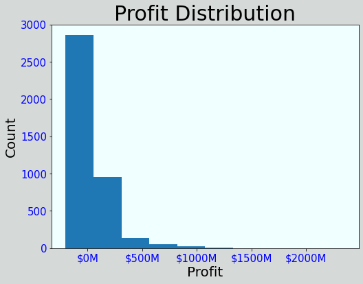
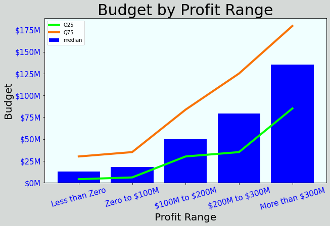
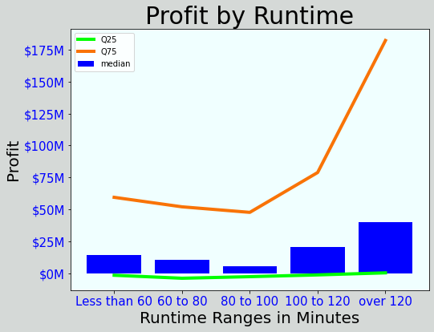

# Movies Analysis for Microsoft

**Author**: [Jin-hoon Chung](mailto:ddjh204@gmail.com)

## Overview

This project shows analysis on movie markets to help Microsoft start building a new movie studio. Several key aspects of popular movies are selected for the analysis. The analysis includes visualizations that would help on where to start.

## Business Problem

As Microsoft has no background in filming a movie, concrete information is needed for a guide on creating a new movie studio. Microsoft is interested in what is needed to be successful. The analysis will cover several aspects of movies that are fairly recent.

## Data

Data is collected from well-known websites for movie databases. For the analysis, the selected aspects of the movie are [gross & budget](https://www.the-numbers.com/), [genre](https://www.themoviedb.org/), and [runtime](https://www.imdb.com/). Profit is calculated by subtracting budget from world gross.The movies are chosen with release years on and after 2000, and this range can be modified. The profit distribution is based on 4045 movies.



## Methods

The analysis of this project shows several visualizations. The visualizations describe how much budget can be estimated, what genres are profitable, and how much the movie length is enough.

## Results

A movie tends to be more successful as the budget increases.



The most profitable genres are animation, adventure, fantasy, family, and Science Fiction.


A movie seems to make the most profit as the runtime is over 120 minutes.



## Conclusions

There are three recommendations to consider to build a new movie studio.

- **The movie tends to be more successful as the budget increases.** This would be a tough decision, but it is encouraged to set the budget as high as possible.
- **The most profitable genres are animation, adventure, fantasy, family, science fiction, action.** The chart shows that those genres typically have profits above zero. It is recommended to choose genres as much as from the six genres.
- **A movie seems to make the most profit as the runtime is over 120 minutes.** The suggested minimum runtime is above 100 minutes, but the runtime over 120 minutes is highly recommended.

### Next Steps

Further analysis could help gain more ideas on creating a new movie.

- **Run the same analysis again for the movies with negative profit.** As the analysis was made for the overall movies, it would be a good idea to do a separate study on the movies with negative profit. This would guide Microsoft on what to avoid when filming a new movie.
- **Research by relating aspects to budget.** Just like how profit was analyzed, the budget can also be related to genre and runtime.
- **Study how the budget can be spent.** Studying on the budget can lead us to other aspects of the movies. The other aspects can be casting size, filming location, and graphic labor or editing cost.

## For More Information

See the full analysis in the [Jupyter Notebook](./MS_Studio_Movie_Analysis.ipynb) or review this [presentation](./Microsoft_Studio_Movie_Analysis.pdf).

For additional info, contact Jin-hoon Chung at [ddjh204@gmail.com](mailto:ddjh204@gmail.com)


## Repository Structure

```
├── code
│   ├── __init__.py
│   ├── data_preparation.py
│   ├── visualizations.py
│   └── eda_notebook.ipynb
├── data
├── images
├── __init__.py
├── README.md
├── Microsoft_Studio_Movie_Analysis.pdf
└── MS Studio_Movie_Analysis.ipynb
```