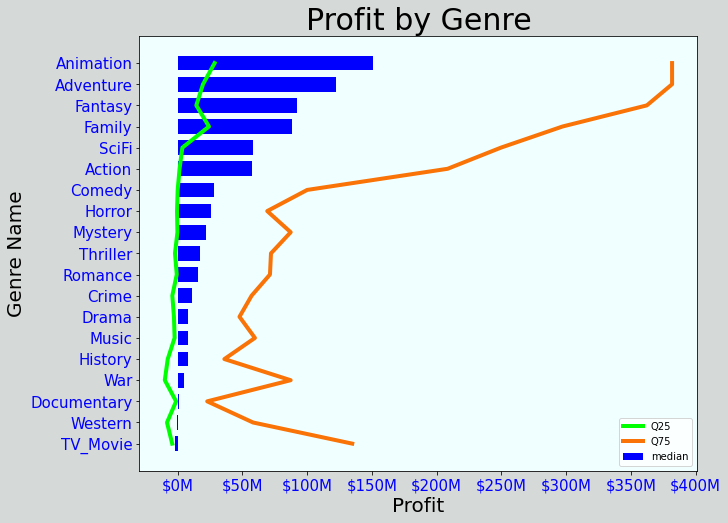

# microsoft_studio_movies_analysis

**Author**: [Jin-hoon Chung](mailto:ddjh204@gmail.com)

## Overview

This project shows analysis on movie markets to help Microsoft start building a new movie studio. Several key aspects of popular movies are selected for the analysis.

## Business Problem

As Microsoft has no background on filming a movie, concrete information is needed for a guide on creating a new movie studio. Microsoft is interested in what is needed to be successful. It would be a good idea to investigate the aspects of the movies that are successful and fairly recent.

## Data

Data is collected from well-known websites for movie database. The selected aspects of movie for the analysis are [gross & budget](https://www.the-numbers.com/), [genre](https://www.themoviedb.org/), and [runtime](https://www.imdb.com/). Profit is calculated by substracting budget from gross, and then the movies with at least $10 million profit are selected. However, profit amount can easily be modified for the different result. The movies are again selected with release years on and after 2000, and this range can be modified as well.


## Methods

The analysis on this project shows several visualizations. The visualizations describe how much budget can be estimated, what genres are popular, and how long the movies are.

## Results

Majority of movies had budget below $50 million.


The most popular genres are drama, comedy, action, thriller, and adventure.



Typical length of movies is between 90 and 120 minutes.


## Conclusions

There are three recommendations to consider to build a new movie studio.

- **The estimated budget to film a movie is below $50 million.** There are movies that costed more than $50 million, but the analysis shows Microsoft does not have to spend similar amount. 
- **The recommended genres for a new movie are drama, comedy, action, thriller, and adventure.** Most movies included multiple genres. If a new movie can include recommended genres as much as possible, this would help lead to a successful business.
- **The runtime for a new movie is recommended to be between 90 to 120 minutes.**

### Next Steps

Further analysis could help gain more ideas on creating a new movie.

- **Run the same analysis again after genres are decided.** Running the same analysis for selected genres would help gain a better result because selecting genres narrows down to a more specific data sample.
- **More research on the relationship between profit and budget.** The analsis shows typical budget for the overall profit. A more sophiscated visualization, such as scatter plot, on a smaller sample is advised.
- **Find more aspects of movies such as casting size and age rating** Movies can be analysis in more ways by including more aspects.

## For More Information

See the full analysis in the [Jupyter Notebook](./MS Studio Movie Analysis.ipynb) or review this [presentation](./Microsoft Studio Movie Analysis.pdf).

For additional info, contact Jin-hoon Chung at [ddjh204@gmail.com](mailto:ddjh204@gmail.com)


## Repository Structure

```
├── code
│   ├── __init__.py
│   ├── data_preparation.py
│   ├── visualizations.py
│   └── eda_notebook.ipynb
├── data
├── images
├── __init__.py
├── README.md
├── Microsoft Studio Movie Analysis.pdf
└── MS Studio Movie Analysis.ipynb
```